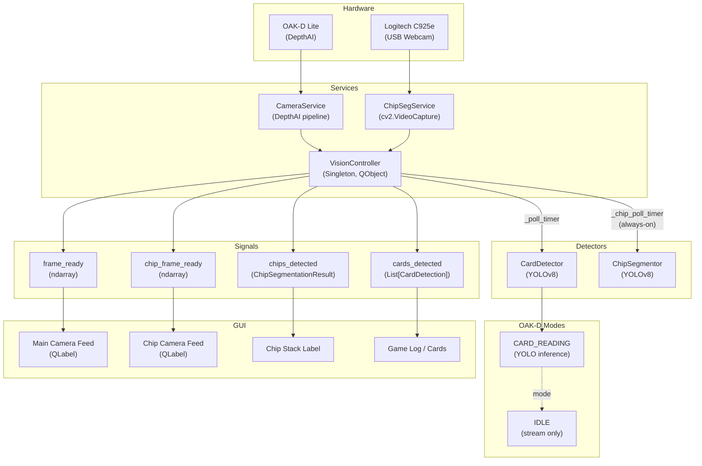

# Dual-Camera Integration Implementation Plan

> **For agentic workers:** REQUIRED SUB-SKILL: Use superpowers:subagent-driven-development (recommended) or superpowers:executing-plans to implement this plan task-by-task. Steps use checkbox (`- [ ]`) syntax for tracking.

**Goal:** Replace the single-camera OAK-D Lite setup with a dual-camera system where the OAK-D Lite handles card detection and a Logitech C925e webcam handles chip segmentation; hand detection is removed entirely.

**Architecture:** A new `ChipSegService` wraps `cv2.VideoCapture` for the C925e. `VisionController` gains a second `QTimer` that drives chip segmentation independently from the main OAK-D polling loop — chip detection is always-on in the background, not a mode of the primary camera. `VisionMode` is simplified to `{IDLE, CARD_READING}`; `HAND_MONITORING` and `CHIP_SEGMENTATION` are removed from the enum. `CameraService` was renamed to `BirdseyeService` (Task 0).

---

## ✅ Task 0: Rename CameraService → BirdseyeService

**Commit:** `refactor: rename CameraService to BirdseyeService`

- `services/camera_service.py` → `services/birdseye_service.py`
- `CameraConfig` → `BirdseyeConfig`, `CameraService` → `BirdseyeService`
- Updated `services/vision_controller.py` import and instantiation
- Updated `docs/diagrams/class-relationships/class-relationships.mmd`
- Updated `docs/diagrams/system-architecture/system-architecture.mmd`
- Updated `CLAUDE.md`

**Tech Stack:** Python 3.12, PySide6, OpenCV (`cv2.VideoCapture`), DepthAI (OAK-D unchanged), Ultralytics YOLOv8, `unittest.mock`

---

## File Map

| Action | Path | Responsibility |
|--------|------|----------------|
| **RENAME** | `services/camera_service.py` → `services/birdseye_service.py` | ✅ Done in Task 0 |
| **CREATE** | `services/chip_seg_service.py` | OpenCV VideoCapture wrapper for Logitech C925e |
| **CREATE** | `tests/test_chip_seg_service.py` | Unit tests for ChipSegService (mocked hardware) |
| **DELETE** | `vision/hand_detector.py` | Hand detection stub — remove entirely |
| **MODIFY** | `services/vision_controller.py` | Remove HandDetector + HAND_MONITORING; add ChipSegService + chip timer + new signals |
| **MODIFY** | `gui/main_window.py` | Remove HAND_MONITORING; add secondary chip cam feed QLabel + chip result label |
| **MODIFY** | `docs/diagrams/vision-pipeline/vision-pipeline.mmd` | Update to show dual-camera paths |
| **MODIFY** | `CLAUDE.md` | Update services and vision sections |

---

## Task 1: Create ChipSegService

**Files:**
- Create: `services/chip_seg_service.py`
- Create: `tests/test_chip_seg_service.py`

The C925e is a standard UVC webcam. On Linux it appears as `/dev/videoN`; on macOS as an AVFoundation device. `cv2.VideoCapture(device_index)` covers both. The Logitech C925e supports 1080p at 30fps — request it explicitly and let OpenCV negotiate.

- [ ] **Step 1: Write the failing tests**

```python
# tests/test_chip_seg_service.py
"""Tests for ChipSegService — no physical webcam required (cv2 mocked)."""
import unittest
from unittest.mock import patch, MagicMock, PropertyMock
import numpy as np


class TestChipSegServiceInit(unittest.TestCase):
    def test_default_config(self):
        from services.chip_seg_service import ChipSegService, ChipSegConfig
        svc = ChipSegService()
        self.assertIsInstance(svc.config, ChipSegConfig)
        self.assertEqual(svc.config.device_index, 0)
        self.assertEqual(svc.config.fps, 30)
        self.assertFalse(svc.running)

    def test_custom_config(self):
        from services.chip_seg_service import ChipSegService, ChipSegConfig
        cfg = ChipSegConfig(device_index=2, width=1280, height=720, fps=15)
        svc = ChipSegService(cfg)
        self.assertEqual(svc.config.device_index, 2)
        self.assertEqual(svc.config.fps, 15)


class TestChipSegServiceLifecycle(unittest.TestCase):
    def _make_mock_cap(self, is_opened=True):
        cap = MagicMock()
        cap.isOpened.return_value = is_opened
        return cap

    @patch('services.chip_seg_service.cv2.VideoCapture')
    def test_start_sets_running_when_device_opens(self, mock_vc):
        mock_vc.return_value = self._make_mock_cap(is_opened=True)
        from services.chip_seg_service import ChipSegService
        svc = ChipSegService()
        svc.start()
        self.assertTrue(svc.running)

    @patch('services.chip_seg_service.cv2.VideoCapture')
    def test_start_clears_running_when_device_fails(self, mock_vc):
        mock_vc.return_value = self._make_mock_cap(is_opened=False)
        from services.chip_seg_service import ChipSegService
        svc = ChipSegService()
        svc.start()
        self.assertFalse(svc.running)

    @patch('services.chip_seg_service.cv2.VideoCapture')
    def test_start_is_idempotent(self, mock_vc):
        mock_vc.return_value = self._make_mock_cap()
        from services.chip_seg_service import ChipSegService
        svc = ChipSegService()
        svc.start()
        svc.start()  # second call should be a no-op
        mock_vc.assert_called_once()

    @patch('services.chip_seg_service.cv2.VideoCapture')
    def test_stop_releases_capture(self, mock_vc):
        cap = self._make_mock_cap()
        mock_vc.return_value = cap
        from services.chip_seg_service import ChipSegService
        svc = ChipSegService()
        svc.start()
        svc.stop()
        cap.release.assert_called_once()
        self.assertFalse(svc.running)
        self.assertIsNone(svc.cap)

    @patch('services.chip_seg_service.cv2.VideoCapture')
    def test_stop_when_not_running_is_safe(self, mock_vc):
        from services.chip_seg_service import ChipSegService
        svc = ChipSegService()
        svc.stop()  # must not raise


class TestChipSegServiceGetFrame(unittest.TestCase):
    @patch('services.chip_seg_service.cv2.VideoCapture')
    def test_get_frame_returns_array_on_success(self, mock_vc):
        cap = MagicMock()
        cap.isOpened.return_value = True
        fake_frame = np.zeros((1080, 1920, 3), dtype=np.uint8)
        cap.read.return_value = (True, fake_frame)
        mock_vc.return_value = cap

        from services.chip_seg_service import ChipSegService
        svc = ChipSegService()
        svc.start()
        frame = svc.get_frame()
        self.assertIsNotNone(frame)
        self.assertEqual(frame.shape, (1080, 1920, 3))

    @patch('services.chip_seg_service.cv2.VideoCapture')
    def test_get_frame_returns_none_on_read_failure(self, mock_vc):
        cap = MagicMock()
        cap.isOpened.return_value = True
        cap.read.return_value = (False, None)
        mock_vc.return_value = cap

        from services.chip_seg_service import ChipSegService
        svc = ChipSegService()
        svc.start()
        frame = svc.get_frame()
        self.assertIsNone(frame)

    def test_get_frame_returns_none_when_not_running(self):
        from services.chip_seg_service import ChipSegService
        svc = ChipSegService()
        self.assertIsNone(svc.get_frame())


class TestChipSegServiceSetFps(unittest.TestCase):
    @patch('services.chip_seg_service.cv2.VideoCapture')
    def test_set_fps_updates_config(self, mock_vc):
        mock_vc.return_value = MagicMock(**{'isOpened.return_value': True})
        from services.chip_seg_service import ChipSegService
        svc = ChipSegService()
        svc.start()
        svc.set_fps(15)
        self.assertEqual(svc.config.fps, 15)

    @patch('services.chip_seg_service.cv2.VideoCapture')
    def test_set_fps_propagates_to_capture(self, mock_vc):
        cap = MagicMock(**{'isOpened.return_value': True})
        mock_vc.return_value = cap
        import cv2
        from services.chip_seg_service import ChipSegService
        svc = ChipSegService()
        svc.start()
        svc.set_fps(15)
        cap.set.assert_any_call(cv2.CAP_PROP_FPS, 15)


if __name__ == '__main__':
    unittest.main()
```

- [ ] **Step 2: Run tests to verify they fail**

```bash
cd /path/to/prap-25-26
python -m pytest tests/test_chip_seg_service.py -v
```
Expected: `ModuleNotFoundError: No module named 'services.chip_seg_service'`

- [ ] **Step 3: Write ChipSegService implementation**

```python
# services/chip_seg_service.py
"""Webcam service for the Logitech C925e (or any standard UVC webcam)."""
import cv2
import numpy as np
from dataclasses import dataclass
from typing import Optional


@dataclass
class ChipSegConfig:
    """Hardware parameters for a standard USB webcam.

    Attributes:
        device_index: cv2.VideoCapture device index (0 = first available).
                      On Linux, corresponds to /dev/video<N>.
        width: Requested capture width in pixels.
        height: Requested capture height in pixels.
        fps: Requested frames per second.
    """
    device_index: int = 0
    width: int = 1920
    height: int = 1080
    fps: int = 30


class ChipSegService:
    """Manages a standard USB webcam via OpenCV VideoCapture.

    Mirrors the CameraService interface (start / stop / get_frame / set_fps)
    so VisionController can treat both cameras uniformly.
    """

    def __init__(self, config: Optional[ChipSegConfig] = None):
        self.config = config if config is not None else ChipSegConfig()
        self.cap: Optional[cv2.VideoCapture] = None
        self.running = False

    def start(self):
        """Open the capture device and configure resolution/FPS."""
        if self.running:
            return

        cap = cv2.VideoCapture(self.config.device_index)
        cap.set(cv2.CAP_PROP_FRAME_WIDTH, self.config.width)
        cap.set(cv2.CAP_PROP_FRAME_HEIGHT, self.config.height)
        cap.set(cv2.CAP_PROP_FPS, self.config.fps)

        if cap.isOpened():
            self.cap = cap
            self.running = True
            print(f"ChipSegService: started on device {self.config.device_index}")
        else:
            cap.release()
            print(f"ChipSegService: failed to open device {self.config.device_index}")

    def stop(self):
        """Release the capture device."""
        self.running = False
        if self.cap is not None:
            self.cap.release()
            self.cap = None
        print("ChipSegService: stopped.")

    def get_frame(self) -> Optional[np.ndarray]:
        """Read the latest frame. Returns None if unavailable."""
        if not self.running or self.cap is None:
            return None
        ret, frame = self.cap.read()
        return frame if ret else None

    def set_fps(self, fps: int):
        """Update the FPS setting. Propagates to the capture device if running."""
        self.config.fps = fps
        if self.running and self.cap is not None:
            self.cap.set(cv2.CAP_PROP_FPS, fps)
```

- [ ] **Step 4: Run tests to verify they pass**

```bash
python -m pytest tests/test_chip_seg_service.py -v
```
Expected: all 12 tests PASS

- [ ] **Step 5: Commit**

```bash
git add services/chip_seg_service.py tests/test_chip_seg_service.py
git commit -m "feat: add ChipSegService for Logitech C925e chip segmentation camera"
```

---

## Task 2: Remove HandDetector and HAND_MONITORING Mode

**Files:**
- Delete: `vision/hand_detector.py`
- Modify: `services/vision_controller.py`

`HandDetector` is a stub (always returns `[]`, no model). `HAND_MONITORING` mode only called `hand_detector.process()` and did nothing with the result. Both are dead weight. After this task, `VisionMode` has three values: `IDLE`, `CARD_READING`, `CHIP_SEGMENTATION` — and `CHIP_SEGMENTATION` will be removed from the enum in Task 3 when it becomes an independent background process.

> **Note:** Do not remove `CHIP_SEGMENTATION` from `VisionMode` in this task — Task 3 handles the chip camera refactor atomically.

- [ ] **Step 1: Write tests verifying HAND_MONITORING is absent**

Add this class to `tests/test_chip_seg_service.py` (or create `tests/test_vision_controller.py` — use a separate file for clarity):

```python
# tests/test_vision_controller.py
"""Tests for VisionController dual-camera refactor."""
import sys
import unittest
from unittest.mock import patch, MagicMock


def _block_hardware():
    """Return a patch.dict that prevents real hardware imports.

    Blocks depthai, ultralytics. cv2 is NOT blocked — it is a standard
    dependency that must be present in the test environment (used elsewhere
    in the project). Individual tests patch specific cv2 symbols as needed.
    """
    return patch.dict('sys.modules', {
        'depthai': MagicMock(),
        'ultralytics': MagicMock(),
    })


class TestVisionModeNoHandMonitoring(unittest.TestCase):
    def test_hand_monitoring_not_in_vision_mode(self):
        with _block_hardware():
            if 'services.vision_controller' in sys.modules:
                del sys.modules['services.vision_controller']
            from services.vision_controller import VisionMode
            mode_names = [m.name for m in VisionMode]
            self.assertNotIn('HAND_MONITORING', mode_names)

    def test_hand_detector_not_imported(self):
        with _block_hardware():
            if 'services.vision_controller' in sys.modules:
                del sys.modules['services.vision_controller']
            import services.vision_controller as vc_mod
            self.assertFalse(hasattr(vc_mod, 'HandDetector'))


if __name__ == '__main__':
    unittest.main()
```

- [ ] **Step 2: Run tests to verify they fail**

```bash
python -m pytest tests/test_vision_controller.py::TestVisionModeNoHandMonitoring -v
```
Expected: FAIL — `HAND_MONITORING` is currently in `VisionMode`

- [ ] **Step 3: Delete hand_detector.py**

```bash
rm vision/hand_detector.py
```

- [ ] **Step 4: Remove HandDetector from VisionController**

In `services/vision_controller.py`, make these changes:

a) Remove the import:
```python
# DELETE this line:
from vision.hand_detector import HandDetector
```

b) Remove from `VisionMode` enum:
```python
class VisionMode(Enum):
    CARD_READING = auto()     # High-resolution capture to identify card ranks and suits.
    CHIP_SEGMENTATION = auto() # Side-view analysis for chip stack estimation.
    IDLE = auto()             # Camera active but no heavy processing.
    # HAND_MONITORING removed — hand detection feature deleted
```

c) Remove `hand_detector` instantiation in `__init__`:
```python
# DELETE this line:
self.hand_detector = HandDetector()  # No model file, stays in dummy mode
```

d) Replace `_handle_phase_change` — previously switched to `HAND_MONITORING`, now switches to `IDLE`:
```python
def _handle_phase_change(self, phase: GamePhase):
    print(f"VisionController: Phase changed to {phase.name}")
    if phase == GamePhase.SHOWDOWN:
        pass
    else:
        self.set_mode(VisionMode.IDLE)
```

e) Remove `HAND_MONITORING` branch in `process_frame`:
```python
def process_frame(self):
    if not self.is_running:
        return
    frame = self.get_frame()
    if frame is None:
        return

    if self.mode == VisionMode.CARD_READING:
        detections = self.card_detector.process(frame)
        draw_card_detections(frame, detections)
        current_set = frozenset(
            (d["rank"], d["suit"]) for d in detections
            if d["rank"] is not None and d["suit"] is not None
        )
        if current_set != self._last_card_set:
            self._last_card_set = current_set
            self.cards_detected.emit(detections)

    elif self.mode == VisionMode.CHIP_SEGMENTATION:
        result = self.chip_segmentor.process(frame)

    self.frame_ready.emit(frame)
```

f) Remove `HAND_MONITORING` from the `set_mode` print block:
```python
def set_mode(self, mode: VisionMode):
    if self.mode != mode:
        print(f"Switching Vision Mode: {self.mode.name} -> {mode.name}")
        self.mode = mode
        if self.mode == VisionMode.CARD_READING:
            print("VisionController: Configuring for Card Reading (High-Res/Still)")
        elif self.mode == VisionMode.CHIP_SEGMENTATION:
            print("VisionController: Configuring for Chip Segmentation (Side View)")
```

- [ ] **Step 5: Run tests to verify they pass**

```bash
python -m pytest tests/test_vision_controller.py::TestVisionModeNoHandMonitoring -v
```
Expected: PASS

- [ ] **Step 6: Verify existing tests still pass**

```bash
python -m pytest tests/ -v
```
Expected: all existing tests (arm_ros_bridge, card_detector, chip_segmentor) still PASS

- [ ] **Step 7: Commit**

```bash
git add -u  # picks up vision/hand_detector.py deletion and vision_controller.py changes
git commit -m "feat: remove HandDetector and HAND_MONITORING mode"
```

---

## Task 3: Integrate C925e into VisionController as Independent Chip Camera

**Files:**
- Modify: `services/vision_controller.py`

The chip camera runs on its own `QTimer`, independently of the OAK-D card camera. `VisionMode.CHIP_SEGMENTATION` is removed from the enum (chip detection is now always-on, not a mode). Two new signals are added: `chip_frame_ready(ndarray)` for the GUI feed, and `chips_detected(dict)` for consuming stack estimates.

The `ChipSegConfig.device_index` defaults to `0`. On systems where the OAK-D or another device occupies index 0, this needs adjustment — document this in the class docstring and note it in `CLAUDE.md`.

- [ ] **Step 1: Write tests for the dual-camera wiring**

Add to `tests/test_vision_controller.py`:

```python
class TestVisionControllerDualCamera(unittest.TestCase):
    """Verify VisionController has chip camera signals and no CHIP_SEGMENTATION mode."""

    def _import_vc(self):
        """Import VisionController with hardware blocked, resetting singleton."""
        import services.vision_controller as vc_mod
        vc_mod.VisionController._instance = None
        return vc_mod

    def test_chip_segmentation_not_in_vision_mode(self):
        with _block_hardware():
            if 'services.vision_controller' in sys.modules:
                del sys.modules['services.vision_controller']
            from services.vision_controller import VisionMode
            mode_names = [m.name for m in VisionMode]
            self.assertNotIn('CHIP_SEGMENTATION', mode_names)

    def test_vision_mode_only_has_idle_and_card_reading(self):
        with _block_hardware():
            if 'services.vision_controller' in sys.modules:
                del sys.modules['services.vision_controller']
            from services.vision_controller import VisionMode
            mode_names = sorted(m.name for m in VisionMode)
            self.assertEqual(mode_names, ['CARD_READING', 'IDLE'])

    def test_chip_frame_ready_signal_exists(self):
        """VisionController must expose chip_frame_ready as a Qt Signal."""
        with _block_hardware():
            if 'services.vision_controller' in sys.modules:
                del sys.modules['services.vision_controller']
            from services.vision_controller import VisionController
            self.assertTrue(hasattr(VisionController, 'chip_frame_ready'))

    def test_chips_detected_signal_exists(self):
        with _block_hardware():
            if 'services.vision_controller' in sys.modules:
                del sys.modules['services.vision_controller']
            from services.vision_controller import VisionController
            self.assertTrue(hasattr(VisionController, 'chips_detected'))

    def test_webcam_service_attribute_after_init(self):
        # Clear all relevant module caches so patching takes effect before
        # class bodies are evaluated (CameraConfig default args reference dai
        # at class-definition time, so camera_service must be re-imported too).
        for mod in ['services.vision_controller', 'services.camera_service',
                    'services.chip_seg_service']:
            sys.modules.pop(mod, None)

        # QTimer construction requires a running QApplication — create a minimal
        # one if none exists.
        try:
            from PySide6.QtWidgets import QApplication
            app = QApplication.instance() or QApplication([])
        except Exception:
            app = None  # PySide6 unavailable in this env — test will be skipped

        with _block_hardware():
            with patch('services.chip_seg_service.cv2', MagicMock()):
                from services.vision_controller import VisionController
                VisionController._instance = None
                vc = VisionController()
                self.assertTrue(hasattr(vc, 'webcam_service'))
                VisionController._instance = None
```

- [ ] **Step 2: Run tests to verify they fail**

```bash
python -m pytest tests/test_vision_controller.py::TestVisionControllerDualCamera -v
```
Expected: FAIL — `CHIP_SEGMENTATION` still in VisionMode, chip signals absent

- [ ] **Step 3: Implement dual-camera VisionController**

Replace the top of `services/vision_controller.py` with the following (complete file):

```python
import cv2
from typing import Optional
from services.camera_service import CameraService, CameraConfig
from services.chip_seg_service import ChipSegService, ChipSegConfig
from enum import Enum, auto
from poker.game_state import GameState, GamePhase
from vision.card_detector import CardDetector
from vision.chip_segmentor import ChipSegmentor

from PySide6.QtCore import QObject, Signal, QTimer
from vision.draw_utils import draw_card_detections
import numpy as np


class VisionMode(Enum):
    """Operational mode for the primary (OAK-D Lite) camera.

    Chip segmentation runs independently on the secondary camera and is
    not represented here.
    """
    CARD_READING = auto()  # OAK-D streams + CardDetector inference.
    IDLE = auto()          # OAK-D streams, no inference.


class VisionController(QObject):
    """Singleton orchestrator for the dual-camera vision pipeline.

    Primary camera (OAK-D Lite):
        - Driven by _poll_timer
        - IDLE: stream only; CARD_READING: YOLO card detection

    Secondary camera (Logitech C925e):
        - Driven by _chip_poll_timer (always-on when running)
        - Runs ChipSegmentor on every frame, emits chips_detected on change

    Camera index note:
        ChipSegConfig.device_index defaults to 0. If a different device
        occupies index 0 on your system, adjust via ChipSegConfig(device_index=N).
        On Linux, list devices with: v4l2-ctl --list-devices
    """
    _instance = None

    # Primary camera signals
    frame_ready = Signal(np.ndarray)          # OAK-D frame (with overlays)
    cards_detected = Signal(list)             # List[CardDetection], on change only

    # Secondary camera signals
    chip_frame_ready = Signal(np.ndarray)     # C925e raw frame for GUI display
    chips_detected = Signal(dict)             # ChipSegmentationResult, on change only

    def __new__(cls):
        if cls._instance is None:
            cls._instance = super(VisionController, cls).__new__(cls)
            cls._instance._initialized = False
        return cls._instance

    def __init__(self):
        if self._initialized:
            return

        super().__init__()

        # Primary camera (OAK-D Lite)
        self.camera_service = CameraService(CameraConfig())
        # Secondary camera (Logitech C925e)
        self.webcam_service = ChipSegService(ChipSegConfig())

        self.mode = VisionMode.IDLE
        self.is_running = False
        self._initialized = True
        self.arm_bridge = None

        # Dedup state
        self._last_card_set: frozenset = frozenset()
        self._last_chip_total: int = -1  # -1 sentinel: first result always emits

        # Detectors
        self.card_detector = CardDetector(
            model_path='vision/models/Card_detection_large_best.pt')
        self.chip_segmentor = ChipSegmentor(
            model_path='vision/models/Chip_segmentation_large_best.pt')

        # Primary camera timer
        self._poll_timer = QTimer()
        self._poll_timer.timeout.connect(self.process_frame)
        self._poll_timer.setInterval(1000 // self.camera_service.config.fps)

        # Chip camera timer (independent, always-on)
        self._chip_poll_timer = QTimer()
        self._chip_poll_timer.timeout.connect(self._process_chip_frame)
        self._chip_poll_timer.setInterval(1000 // self.webcam_service.config.fps)

    # ------------------------------------------------------------------
    # Properties
    # ------------------------------------------------------------------

    @property
    def fps(self) -> int:
        return self.camera_service.config.fps

    # ------------------------------------------------------------------
    # Lifecycle
    # ------------------------------------------------------------------

    def start(self):
        """Start both cameras and processing loops."""
        if not self.is_running:
            self.camera_service.start()
            self.webcam_service.start()
            self.is_running = True
            self._poll_timer.start()
            self._chip_poll_timer.start()
            print("VisionController started (OAK-D + C925e).")

    def stop(self):
        """Stop both cameras and processing loops."""
        if self.is_running:
            self._poll_timer.stop()
            self._chip_poll_timer.stop()
            self.camera_service.stop()
            self.webcam_service.stop()
            self.is_running = False
            print("VisionController stopped.")

    # ------------------------------------------------------------------
    # FPS control
    # ------------------------------------------------------------------

    def set_fps(self, fps: int):
        """Update OAK-D polling rate and hardware FPS."""
        if fps < 1:
            return
        self._poll_timer.setInterval(1000 // fps)
        try:
            self.camera_service.set_fps(fps)
        except Exception as e:
            print(f"VisionController: failed to set camera fps: {e}")

    def set_chip_fps(self, fps: int):
        """Update chip camera polling rate."""
        if fps < 1:
            return
        self._chip_poll_timer.setInterval(1000 // fps)
        try:
            self.webcam_service.set_fps(fps)
        except Exception as e:
            print(f"VisionController: failed to set chip camera fps: {e}")

    # ------------------------------------------------------------------
    # Mode & connections
    # ------------------------------------------------------------------

    def set_mode(self, mode: VisionMode):
        if self.mode != mode:
            print(f"Switching Vision Mode: {self.mode.name} -> {mode.name}")
            self.mode = mode

    def connect_to_game_state(self, game_state: GameState):
        game_state.on_phase_change.connect(self._handle_phase_change)
        game_state.on_card_detection_required.connect(self._handle_card_detection)
        game_state.on_pot_change.connect(self._handle_pot_change)

    def connect_to_arm_bridge(self, bridge):
        self.arm_bridge = bridge

    def request_arm_move(self, x: float, y: float, z: float,
                         pitch: float, roll: float, duration: float):
        if self.arm_bridge and self.arm_bridge.is_available:
            self.arm_bridge.move_pose(x, y, z, pitch, roll, duration)

    # ------------------------------------------------------------------
    # Game state handlers
    # ------------------------------------------------------------------

    def _handle_phase_change(self, phase: GamePhase):
        print(f"VisionController: Phase changed to {phase.name}")
        if phase != GamePhase.SHOWDOWN:
            self.set_mode(VisionMode.IDLE)

    def _handle_card_detection(self, cards):
        print("VisionController: Card detection required.")
        self.set_mode(VisionMode.CARD_READING)

    def _handle_pot_change(self, total_pot: int):
        print(f"VisionController: Pot updated to {total_pot}.")

    # ------------------------------------------------------------------
    # Frame processing
    # ------------------------------------------------------------------

    def get_frame(self):
        return self.camera_service.get_frame()

    def process_frame(self):
        """Primary (OAK-D) processing loop — called by _poll_timer."""
        if not self.is_running:
            return
        frame = self.get_frame()
        if frame is None:
            return

        if self.mode == VisionMode.CARD_READING:
            detections = self.card_detector.process(frame)
            draw_card_detections(frame, detections)
            current_set = frozenset(
                (d["rank"], d["suit"]) for d in detections
                if d["rank"] is not None and d["suit"] is not None
            )
            if current_set != self._last_card_set:
                self._last_card_set = current_set
                self.cards_detected.emit(detections)

        self.frame_ready.emit(frame)

    def _process_chip_frame(self):
        """Secondary (C925e) processing loop — called by _chip_poll_timer."""
        if not self.is_running:
            return
        frame = self.webcam_service.get_frame()
        if frame is None:
            return

        result = self.chip_segmentor.process(frame)
        self.chip_frame_ready.emit(frame)

        # Only emit chips_detected when the total chip value changes
        new_total = result["stack"].total
        if new_total != self._last_chip_total:
            self._last_chip_total = new_total
            self.chips_detected.emit(result)
```

- [ ] **Step 4: Run tests to verify they pass**

```bash
python -m pytest tests/test_vision_controller.py -v
```
Expected: all tests PASS

- [ ] **Step 5: Run full test suite**

```bash
python -m pytest tests/ -v
```
Expected: all tests PASS

- [ ] **Step 6: Commit**

```bash
git add services/vision_controller.py tests/test_vision_controller.py
git commit -m "feat: integrate C925e chip camera as independent background pipeline in VisionController"
```

---

## Task 4: Update GUI for Dual-Camera

**Files:**
- Modify: `gui/main_window.py`

Changes:
1. Remove `HAND_MONITORING` and `CHIP_SEGMENTATION` from `_MODE_COLOURS` (neither exists in `VisionMode` anymore).
2. Connect `chip_frame_ready` → new secondary `QLabel` camera feed.
3. Connect `chips_detected` → new chip stack result label.
4. The secondary chip cam feed should be compact (not competing with the main feed) — use a fixed-height `QLabel` at the bottom of the right panel.

- [ ] **Step 1: Write test for mode colours**

```python
# Append to tests/test_vision_controller.py

class TestMainWindowModeColours(unittest.TestCase):
    """Ensure _MODE_COLOURS only references valid VisionMode values."""

    def test_mode_colours_keys_are_valid_vision_modes(self):
        with _block_hardware():
            if 'services.vision_controller' in sys.modules:
                del sys.modules['services.vision_controller']
            if 'gui.main_window' in sys.modules:
                del sys.modules['gui.main_window']
            with patch.dict('sys.modules', {
                'PySide6': MagicMock(),
                'PySide6.QtWidgets': MagicMock(),
                'PySide6.QtCore': MagicMock(),
                'PySide6.QtSvgWidgets': MagicMock(),
                'services.arm_ros_bridge': MagicMock(),
                'poker.game_state': MagicMock(),
                'poker.player': MagicMock(),
                'poker.action': MagicMock(),
                'gui.utils': MagicMock(),
            }):
                from services.vision_controller import VisionMode
                from gui.main_window import MainWindow
                valid_modes = set(VisionMode)
                for key in MainWindow._MODE_COLOURS:
                    self.assertIn(key, valid_modes,
                        f"_MODE_COLOURS has key {key} not in VisionMode")
```

> **Note:** This test is intentionally lightweight — it only checks key consistency, not widget construction (which requires a full QApplication). Run it with `pytest` as usual.

- [ ] **Step 2: Run test to verify it fails**

```bash
python -m pytest tests/test_vision_controller.py::TestMainWindowModeColours -v
```
Expected: FAIL — `HAND_MONITORING` / `CHIP_SEGMENTATION` keys are stale in `_MODE_COLOURS`

- [ ] **Step 3: Update gui/main_window.py**

a) Add `chip_frame_ready` import (already works via existing `VisionController` import).

b) In `__init__`, after the existing `self.camera_feed` label, add the chip feed section at the bottom of `right_layout`:

```python
# Chip Camera Feed (Logitech C925e)
chip_header = QLabel("Chip Camera Feed (C925e)")
chip_header.setObjectName("cameraHeaderLabel")
chip_header.setAlignment(Qt.AlignCenter)
right_layout.addWidget(chip_header)

self.chip_feed = QLabel("Chip Camera Feed Placeholder")
self.chip_feed.setObjectName("cameraFeed")
self.chip_feed.setAlignment(Qt.AlignCenter)
self.chip_feed.setFixedHeight(180)
self.chip_feed.setStyleSheet("background-color: #111; border: 1px solid #333;")
right_layout.addWidget(self.chip_feed)

self.chip_result_label = QLabel("Chips: —")
self.chip_result_label.setObjectName("infoLabel")
self.chip_result_label.setAlignment(Qt.AlignCenter)
right_layout.addWidget(self.chip_result_label)
```

c) In `__init__`, connect chip signals (after the existing vision_controller signal connections):

```python
self.vision_controller.chip_frame_ready.connect(self._update_chip_feed)
self.vision_controller.chips_detected.connect(self._on_chips_detected)
```

d) Add handler methods:

```python
def _update_chip_feed(self, frame: np.ndarray):
    if frame is not None:
        qt_img = convert_cv_qt(frame)
        self.chip_feed.setPixmap(qt_img.scaled(
            self.chip_feed.size(), Qt.KeepAspectRatio, Qt.SmoothTransformation
        ))

def _on_chips_detected(self, result: dict):
    total = result["stack"].total
    conf = result["confidence"]
    self.chip_result_label.setText(f"Chips: {total} (conf: {conf:.0%})")
    self.log_message(f"Chip stack updated: {total} (conf: {conf:.0%})")
```

e) Update `_MODE_COLOURS` — remove `HAND_MONITORING` and `CHIP_SEGMENTATION`:

```python
_MODE_COLOURS = {
    VisionMode.CARD_READING: "#00FFFF",   # Cyan
}
```

f) Update `update_mode_label` fallback colour comment (no functional change needed, just ensure it handles `IDLE` with the yellow default gracefully — the existing `get()` with `"yellow"` default already handles this).

- [ ] **Step 4: Run test to verify it passes**

```bash
python -m pytest tests/test_vision_controller.py::TestMainWindowModeColours -v
```
Expected: PASS

- [ ] **Step 5: Run full test suite**

```bash
python -m pytest tests/ -v
```
Expected: all tests PASS

- [ ] **Step 6: Commit**

```bash
git add gui/main_window.py
git commit -m "feat: add chip camera feed and chip stack display to GUI"
```

---

## Task 5: Update Diagrams and Docs

**Files:**
- Modify: `docs/diagrams/vision-pipeline/vision-pipeline.mmd`
- Modify: `CLAUDE.md`

- [ ] **Step 1: Update the vision pipeline diagram**

Replace `docs/diagrams/vision-pipeline/vision-pipeline.mmd` with:



- [ ] **Step 2: Render the updated diagram**

```bash
cd docs/diagrams
bash render.sh -a
```
(Requires `npx @mermaid-js/mermaid-cli` — see render.sh for setup.)

- [ ] **Step 3: Update CLAUDE.md**

In the `Services (services/)` section, update the `vision_controller.py` bullet to reflect dual-camera:

- Replace the `VisionController` modes list: `IDLE, CARD_READING` (remove `HAND_MONITORING`, `CHIP_SEGMENTATION`)
- Add: `chip_seg_service.py — ChipSegService (Logitech C925e via cv2.VideoCapture)`
- Remove: HandDetector mention
- Update signals: add `chip_frame_ready(ndarray)`, `chips_detected(dict)`

In the `Vision (vision/)` section:
- Remove `hand_detector.py` line

Update the `Data Flow` section:
```
OAK-D Lite → CameraService → VisionController (IDLE/CARD_READING) → CardDetector → cards_detected → MainWindow
C925e → ChipSegService → VisionController (_chip_poll_timer, always-on) → ChipSegmentor → chips_detected → MainWindow
```

- [ ] **Step 4: Commit docs and diagram**

```bash
git add docs/diagrams/vision-pipeline/ CLAUDE.md
git commit -m "docs: update vision pipeline diagram and CLAUDE.md for dual-camera setup"
```

---

## Device Index Reference

| Platform | OAK-D Lite | Logitech C925e (default) |
|----------|-----------|--------------------------|
| Linux | DepthAI (not V4L2) | `/dev/video0` → index 0 |
| macOS | DepthAI (not AVFoundation) | First webcam → index 0 |

If the C925e is not on index 0, update `ChipSegConfig(device_index=N)` in `VisionController.__init__`. To list devices on Linux: `v4l2-ctl --list-devices`. On macOS: `system_profiler SPCameraDataType`.

---

## Testing Checklist (No Hardware Required)

```bash
# Run all tests after each task
python -m pytest tests/ -v

# Individual test files
python -m pytest tests/test_chip_seg_service.py -v
python -m pytest tests/test_vision_controller.py -v
python -m pytest tests/test_arm_ros_bridge.py -v  # must still pass unchanged
```

## Manual Smoke Test (With Hardware)

1. Plug in both OAK-D Lite (USB-C) and Logitech C925e (USB-A)
2. `python main.py`
3. Main camera feed shows OAK-D stream
4. Chip camera feed shows C925e stream (bottom of right panel)
5. Toggle card detection — mode label switches IDLE ↔ CARD_READING
6. Press "Start Hand" → phase changes, VisionController logs `Phase changed to PRE_FLOP`
7. Chip stack label updates as C925e detects chips (or shows `Chips: 0 (conf: 0%)` in dummy/no-chip mode)
